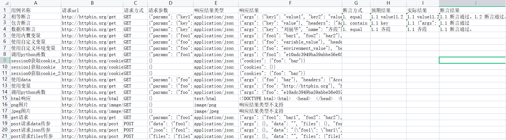

:link:[真希望你没见过什么世面，一生只爱我这张平凡的脸](https://music.163.com/#/song?id=1963720173)

# 带带弟弟pytest

本项目实现接口自动化的技术选型：**Python+Requests+Pytest+Yaml+Excel+Loguru** ， 通过Python+Requests来发送和处理HTTP协议的请求接口，
使用Pytest作为测试执行器，使用YAML+Excel管理测试数据，使用Loguru管理日志。

## 特征

- 采用统一请求封装，session自动关联
- 采用关键字驱动设计
- 支持多session之间切换
- Yaml文件可关联Excel文件，Yaml文件存放公共测试数据，Excel文件存放测试数据
- yaml及Excel文件中均可使用变量、调用python函数
- 多变量环境，可设置变量，全局变量及环境变量
- 支持多套配置文件之间切换
- 支持mysql数据库连接及操作
- 自动处理请求中的files数据，自动提取请求、响应中的内容、自动断言
- 项目运行自动生成Log日志文件

:loudspeaker:项目测试环境：win11+python3.10

## 测试报告



## Demo部署

- 下载项目源码后，在根目录下找到**requirements.txt**文件，然后通过 pip 工具安装 requirements.txt 依赖，执行命令：

```shell
pip3 install -r requirements.txt
```

[comment]: <> (- 下载并配置allure2，下载安装教程如下：https://blog.csdn.net/lixiaomei0623/article/details/120185069)

- 在**config/local.yaml**文件中配置数据库参数，运行**user.sql**初始化数据库。

- 之后运行**main.py**，或在Terminal窗口cd到项目根目录后执行命令：

```shell
pytest
```

[comment]: <> (## 项目结构)

[comment]: <> (```text)

[comment]: <> (├─common		公共方法)

[comment]: <> (├─config		项目配置文件)

[comment]: <> (├─data			存放测试数据)

[comment]: <> (├─doc                   项目文档)

[comment]: <> (├─environment		环境变量)

[comment]: <> (├─img			图像文件)

[comment]: <> (├─logs			日志文件)

[comment]: <> (├─script		测试用例执行脚本)

[comment]: <> (├─testcase		存放测试用例)

[comment]: <> (├─utils			各种工具类)

[comment]: <> (├─main.py		项目运行入口	)

[comment]: <> (├─pytest.ini		pytest配置文件)

[comment]: <> (├─requirements.txt	相关依赖包文件)

[comment]: <> (└─user.sql		初始化数据库表	)

[comment]: <> (```)

## Example

```python
from functools import partial
from common.read.readTestcase import readTestcase
from common.request.autoRequest import autoRequest
from script.conftest import parametrize

rt = partial(readTestcase, "method.yaml")


@parametrize(rt())
async def test_get(case):
	await autoRequest(case)
```

```yaml
# method.yaml
- casename: get请求
  request:
    url: http://httpbin.org/get
    method: GET
    params:
      foo1: bar1
      foo2: bar2
```

## 高级使用

1. 项目使用可参考[文档](system/doc/项目使用.md)
2. 用例文件编写规则详见[yaml用例编写规则.md](system/doc/yaml用例编写规则.md)

## 支持

1. 如果喜欢ddddpytest，可以在GitHub Star。
2. 本项目使用过程中遇到问题或一起交流学习可添加微信或
   [telegram](https://t.me/qingtest) 进行沟通。

