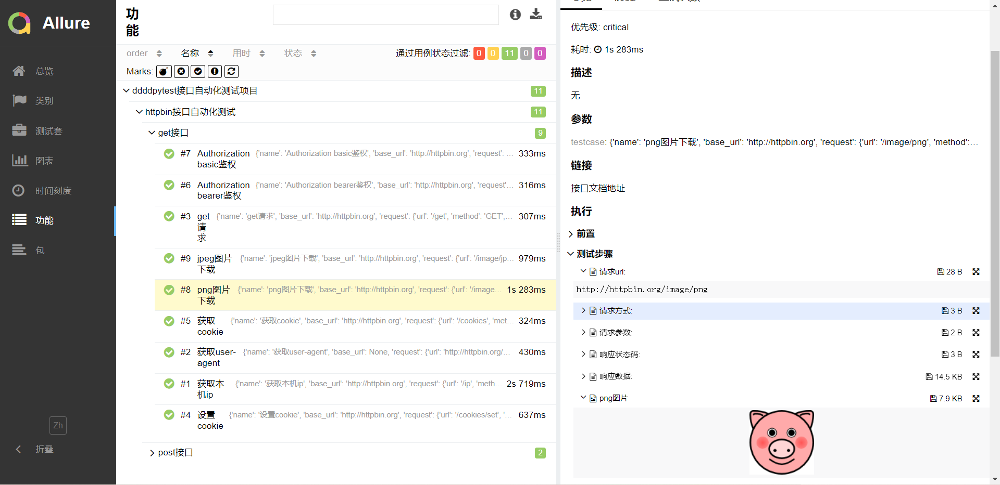
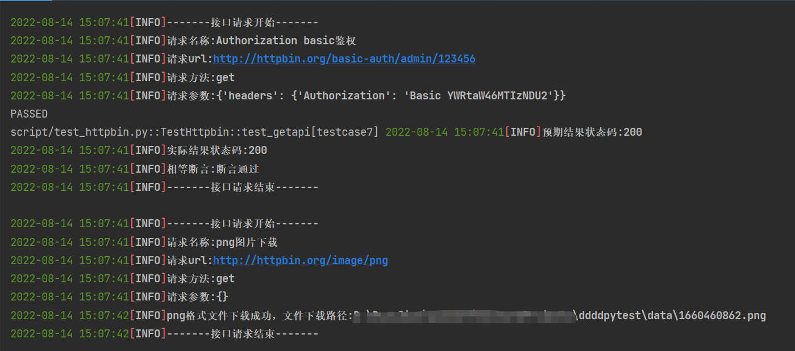
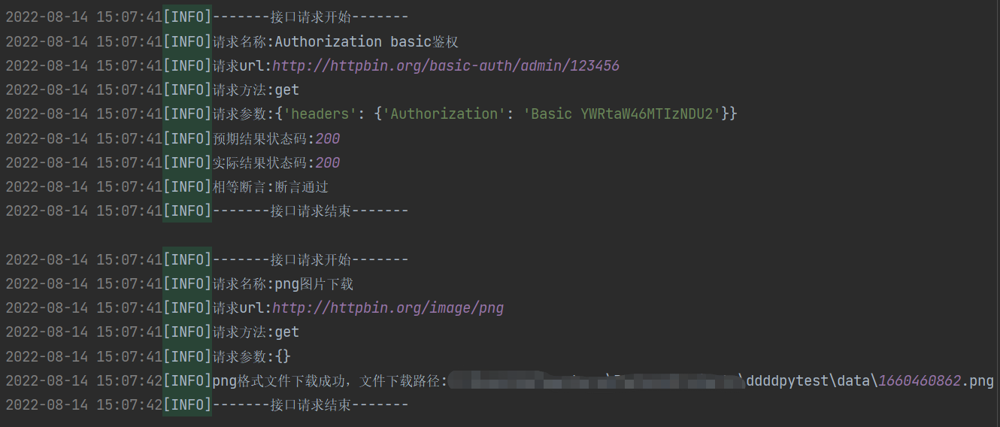
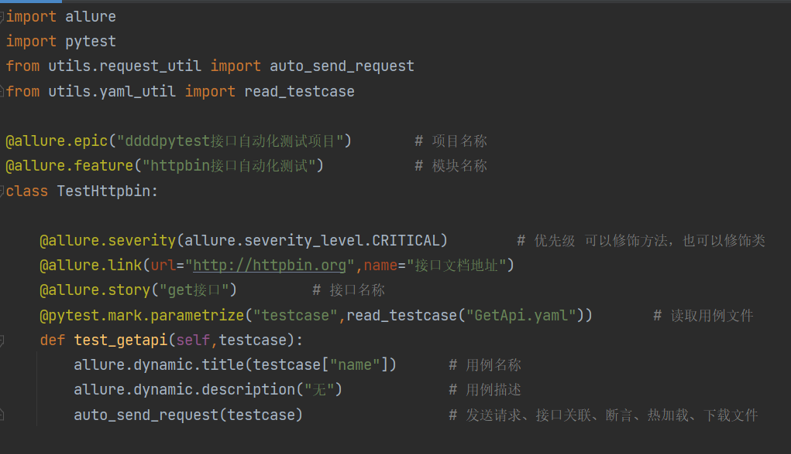
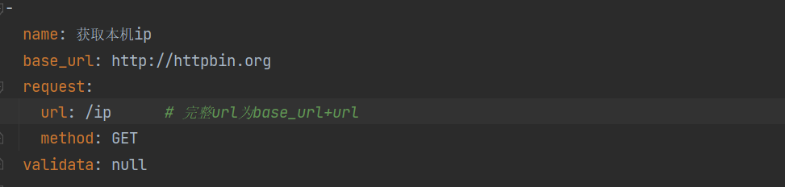
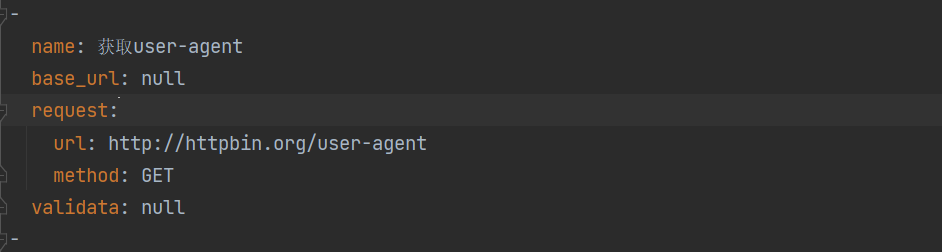
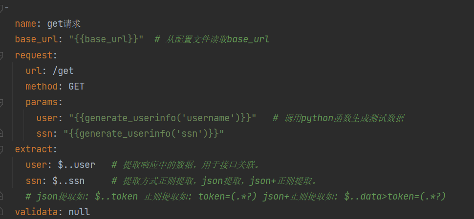
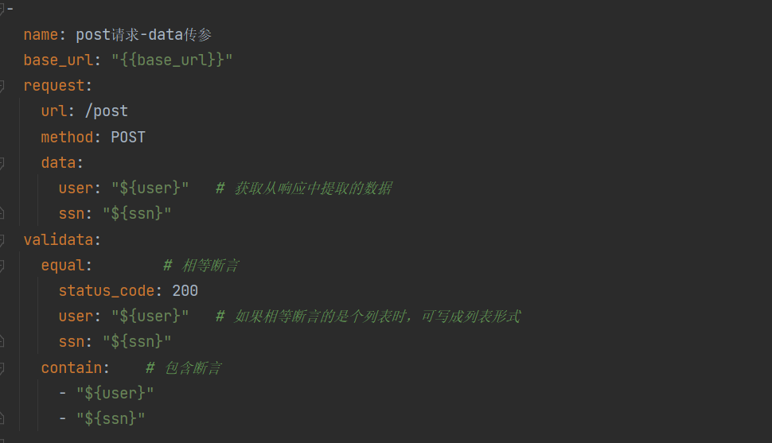

[真希望你没见过什么世面，一生只爱我这张平凡的脸](https://music.163.com/#/song?id=1963720173)

# 带带弟弟pytest

本项目实现接口自动化的技术选型：**Python+Requests+Pytest+YAML+Allure+Loguru+Jinja2** ，
通过 Python+Requests 来发送和处理HTTP协议的请求接口， 使用 Pytest 作为测试执行器，
使用 YAML 来管理测试数据，使用 Allure 来生成测试报告，使用Loguru来管理日志，
使用jinja2来渲染测试数据

采用统一请求封装，会自动进行cookie关联。实现自动发送请求,自动接口关联包括token全局关联,自动对响应断言。
编写完测试用例和执行脚本后，会自动生成测试报告和日志。

## 更新内容

1. 优化allure报告展示



2. 优化日志展示

控制台日志


文件日志


## 三件事

1. 本人的运行环境为win11+python3.10，向下兼容其它python版本应该是没问题的。
2. 支持与jenkins持续集成 `pytest  allure generate ./temp -o ./report --clean`
3. testcase模块存放yaml测试用例，script目录编写执行脚本

## 项目部署

首先，下载项目源码后，在根目录下找到 ```requirements.txt``` 文件，然后通过 pip 工具安装 requirements.txt 依赖，执行命令：
```
pip3 install -r requirements.txt
```
下载并配置allure2，下载安装教程如下：https://blog.csdn.net/lixiaomei0623/article/details/120185069

之后运行`all_run.py`文件，或在命令行窗口cd到根目录后执行命令：
```
pytest
```

## 项目使用



### yaml测试用例格式示例

#### 示例1



#### 示例2



#### 示例3



### 示例4



## 测试报告效果展示

**注意**: 运行`all_run.py`或与jenkins持续集成时才能在report模块下生成allure测试报告。
temp模块生成的是临时的测试报告。


## 项目结构

- api >> 接口封装层，如封装HTTP接口为Python接口
- utils >> 各种工具类
- config.yaml >> 配置文件
- script >> 测试用例执行脚本
- pytest.ini >> pytest配置文件
- requirements.txt >> 相关依赖包文件
- testcase >> 测试用例
- log >> 日志文件
- report >> allure测试报告
- temp >> allure临时报告
- all_run.py >> 运行所有脚本
- extract.yaml >> 接口关联文件
- dynamic_load.py >> 编写生成测试数据方法

## 联系作者

本人也在学习python中，本项目使用过程中或python学习中遇到问题，都可以与我交流哈。

