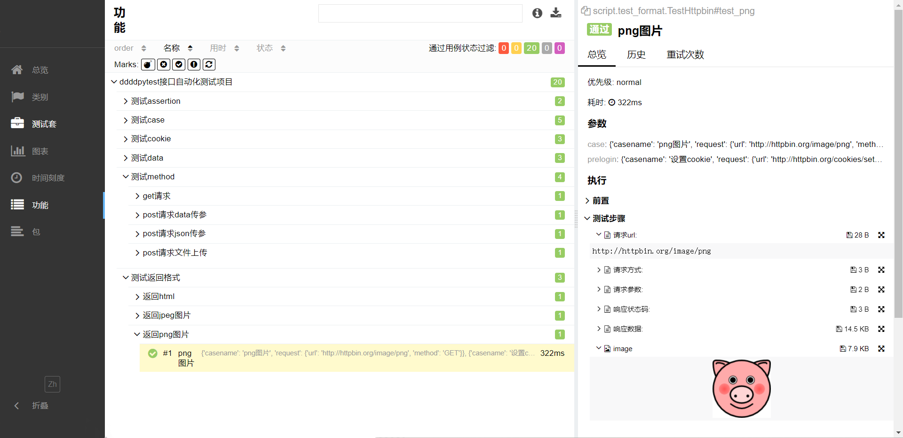

:link:[真希望你没见过什么世面，一生只爱我这张平凡的脸](https://music.163.com/#/song?id=1963720173)
# 带带弟弟pytest

本项目实现接口自动化的技术选型：**Python+Requests+Pytest+Allure+YAML+CSV+Loguru** ，
通过 Python+Requests 来发送和处理HTTP协议的请求接口， 使用 Pytest 作为测试执行器，
使用 Allure 生成测试报告，使用 YAML +CSV管理测试数据，使用Loguru管理日志。

- 采用统一请求封装，session自动关联
- 支持多session之间切换
- 多变量环境，可设置变量，全局变量及环境变量
- 支持多套配置文件之间切换
- Yaml文件可关联Csv文件，Yaml文件存放公共测试数据，Csv文件存放测试数据
- yaml及Csv文件中均可使用变量、调用python函数
- 支持mysql数据库连接及操作
- 自动处理请求中的files数据
- 项目运行自动生成Log日志文件、Allure报告

:loudspeaker:项目测试环境：win11+python3.10

## Allure报告



## Demo部署

- 下载项目源码后，在根目录下找到**requirements.txt**文件，然后通过 pip 工具安装 requirements.txt 依赖，执行命令：

```shell
pip3 install -r requirements.txt
```
- 下载并配置allure2，下载安装教程如下：https://blog.csdn.net/lixiaomei0623/article/details/120185069

- 在**config/local.yaml**文件中配置数据库参数，运行**user.sql**初始化数据库。

- 之后运行**main.py**，或在Terminal窗口cd到项目根目录后执行命令：

```shell
pytest
```

## 项目结构

- common >> 各种工具类
- config >> 项目配置文件
- data >> 存放测试数据
- environment >> 环境变量
- log >> 日志文件
- report >> allure测试报告
- script >> 测试用例执行脚本
- temp >> allure临时报告
- testcase >> 存放测试用例
- main.py >> 项目运行入口
- pytest.ini >> pytest配置文件
- requirements.txt >> 相关依赖包文件
- user.sql >> 初始化数据库表

## 项目使用

**demo**

```python
# 接口名称
@allure.story("get请求")
# 读取用例文件
@pytest.mark.parametrize("case", dp.read_testcase("method.yaml"))
def test_get(self, case):
    # 用例名称
    allure.dynamic.title(case.pop("casename"))
    # 发送请求
    dp.requests().autoRequest(**case.get("request"))
```

```yaml
# yaml
-
  casename: get请求
  request:
    url: http://httpbin.org/get
    method: GET
    params:
      foo1: bar1
      foo2: bar2
```

### 发送请求

```python
# 发送请求 url、files、kwargs渲染;files处理;生成log日志及allure报告;
# 参数 method:请求方式 url:请求url,files:文件,sess:session,timeout请求超时,kwargs其它参数;
# sess默认为索引为0的session
dp.requests().autoRequest(method,url,[files=None,sess=None,timeout=10,**kwargs])
# 发送get请求
dp.requests().get(url,[files=None,sess=None,timeout=10,**kwargs])
# 发送post请求
dp.requests().post(url,[files=None,sess=None,timeout=10,**kwargs])
```

### 读取用例

```python
# 读取testcase目录下的yaml文件;
# 参数 file_name:yaml文件文件名,yaml文件中的索引
dp.read_testcase(file_name, [item=0])
```

### 变量

```python
# 设置变量
# 参数 key:变量名 value:变量值
dp.variables().set(key,value)
# # 获取变量
dp.variables().get(key)
# 设置环境变量
dp.environment().set(key,value)
# 获取环境变量
dp.environment().get(key)
# 设置全局变量
dp.globals().set(key,value)
# 获取全局变量
dp.globals().get(key)
```

### session

```python
# 创建session
# 参数 item:创建session数量
dp.session().create([item=1])
# 获取session
# 参数 seek:session指向,默认为第一个session
# 注意:切换seek指向后，不传seek参数时默认为上一次的seek
dp.session()([seek=None])
```

### 使用内置函数

```python
# 使用内置函数
# func()为具体的函数
dp.function().func()
```

### 用例文件

```yaml
# yaml
# ${变量名} 为使用已存在的变量
# {{func(*args)}} 为调用python函数
# 注意: 使用变量及调用python函数的地方必须用单引号或双引号包裹
# csv文件使用变量及调用python函数同yaml文件
-
  casename: 调用python函数
  request:
    url: "${base_url}/get"
    method: GET
    params:
      foo1: "{{md5(123456)}}"
      foo2: "{{mock().cname()}}"
```

### yaml关联csv文件

```yaml
# yaml
# data_path：使用该字段关联csv文件
# ${变量名或csv中列名}：为csv文件中列名时将会被循环替换为对应的值，生成关联后的用例集
-
  casename: "${casename}"
  data_path: data.csv
  request:
    url: "${base_url}/get"
    method: GET
    params:
      foo: "${foo}"
```

## 联系作者

如果喜欢该项目就:star2:下吧。:heart:本项目学习及使用过程中遇到问题可添加本人微信进行沟通。

